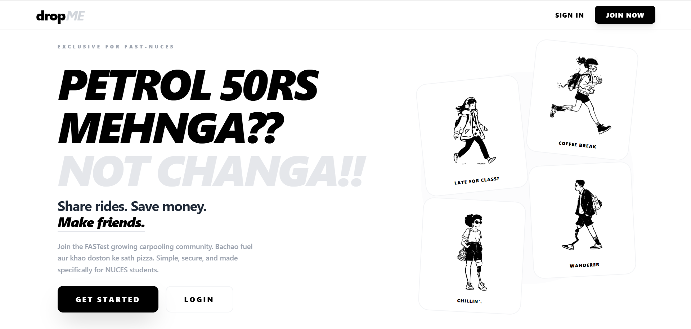
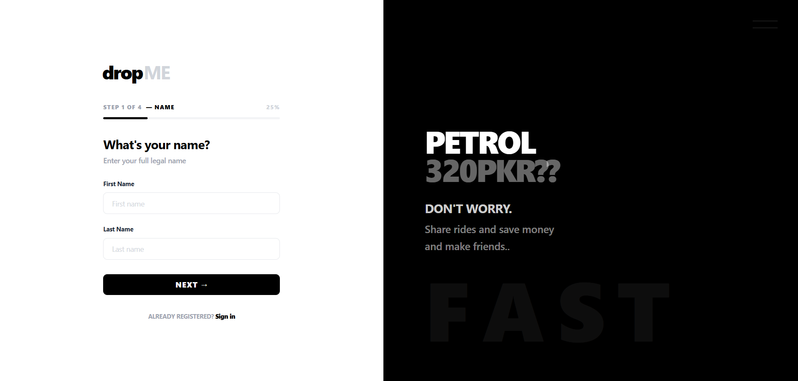
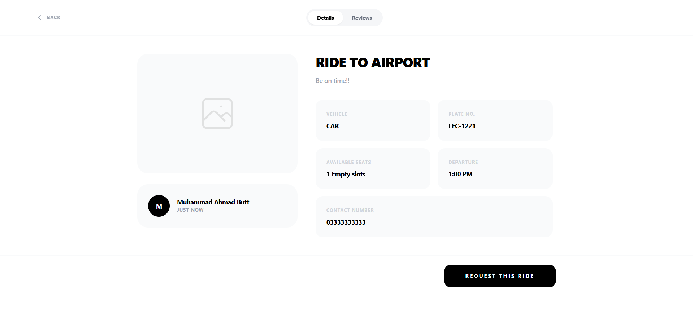
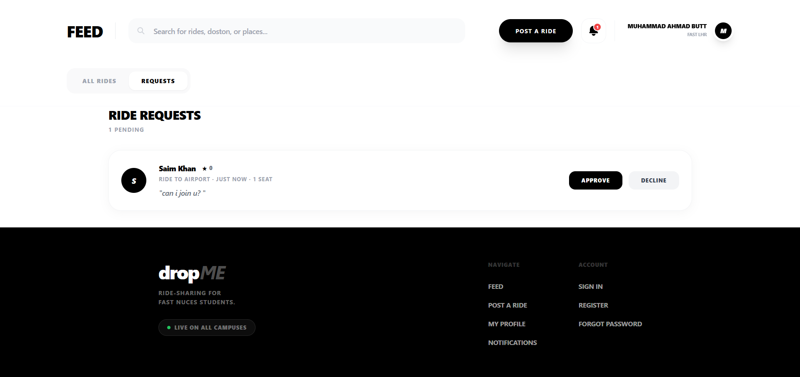
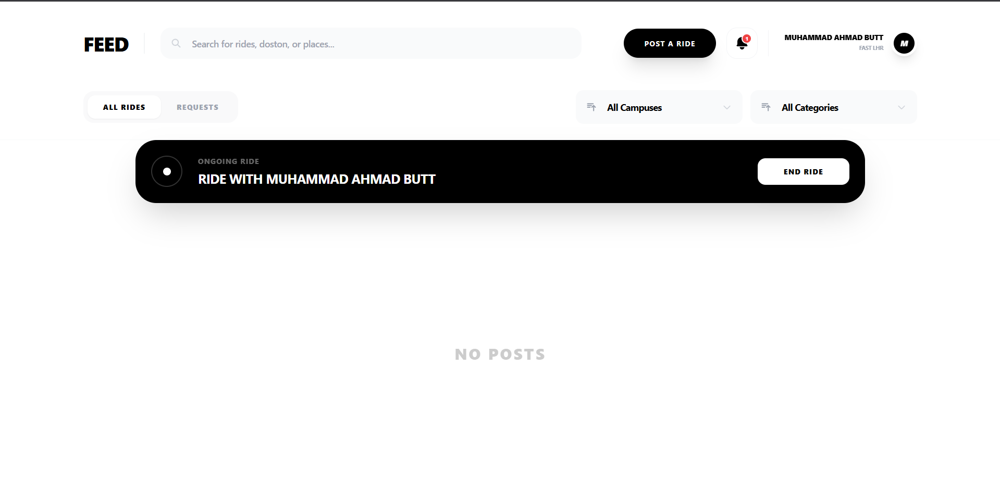
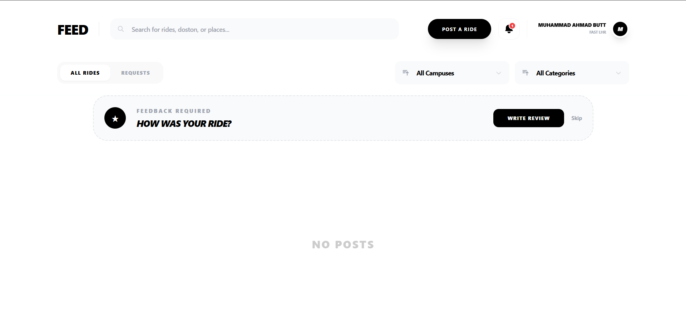
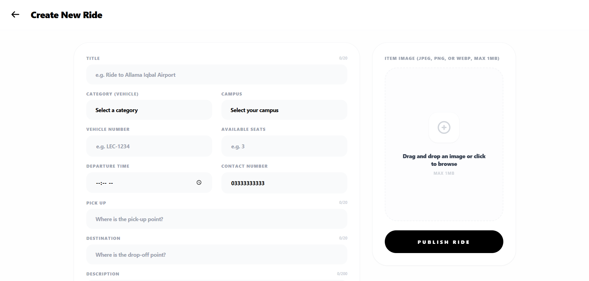
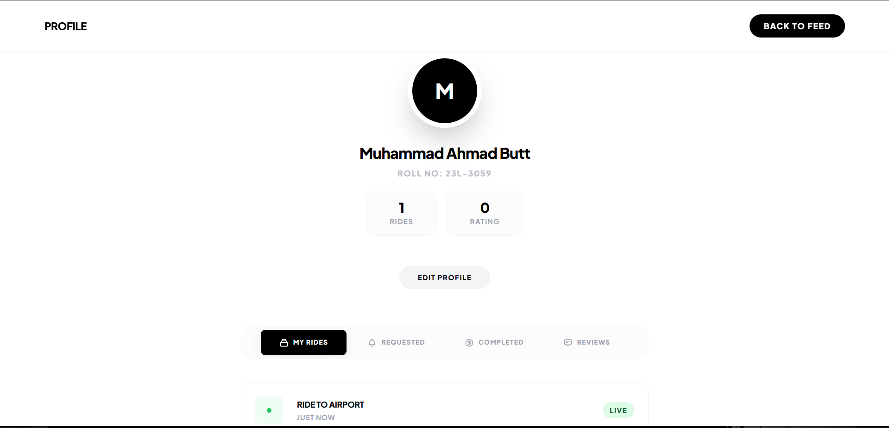

# FAST Car-Pooling System

A comprehensive web application designed for students and faculty of FAST-NUCES to facilitate efficient and secure car-pooling across different campuses. This project streamlines the process of finding rides, sharing costs, and reducing the campus carbon footprint.

## Demo Screenshots










## Academic Context
- **Course**: Web Programming
- **Instructor**: Mam Mahek
- **Assignment**: Assignment 2
- **Developed by**: Muhammad Ahamad Butt (23L-3059)

## System Overview

The Car-Pooling system implements a robust state management architecture using Redux Toolkit to handle complex ride interactions, user sessions, and real-time notifications.

## Technical Implementation

### Core Architecture
- **Frontend Framework**: React 19 with Vite (Fast Refresh & HMR)
- **State Management**: Redux Toolkit (Slices for Auth, Rides, Users, and Notifications)
- **Styling**: Tailwind CSS (Utility-first, responsive design)
- **Navigation**: React Router 7
- **Form Handling**: React Hook Form
- **Data Persistence**: LocalStorage sync for demo persistence

### Key Features
- **Campus Specific Filtering**: Support for Lahore, Islamabad, Karachi, Peshawar, Multan, and Faisalabad campuses.
- **Academic Email Validation**: RegEx-based validation for `@nu.edu.pk` email addresses.
- **Seat Management**: Real-time decrementing of available seats upon ride acceptance.
- **Responsive Design**: Mobile-first approach ensuring usability on all device sizes.
- **Secure Authentication**: Password validation and secure session management logic.

## Operational Workflow

### 1. Environment Configuration
Clone the repository and install dependencies:
```bash
cd frontend
npm install
```

### 2. Development Server
Start the Vite development server:
```bash
npm run dev
```
The application will be accessible at `http://localhost:5173`.

### 3. Build for Production
Generate a production-ready bundle:
```bash
npm run build
```

*Developed for educational purposes as part of the Artificial Intelligence curriculum at FAST-NUCES.*
